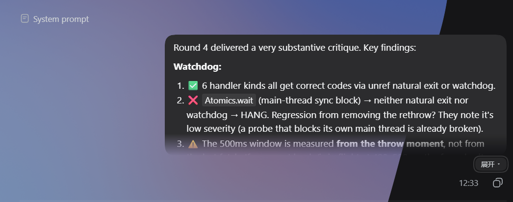
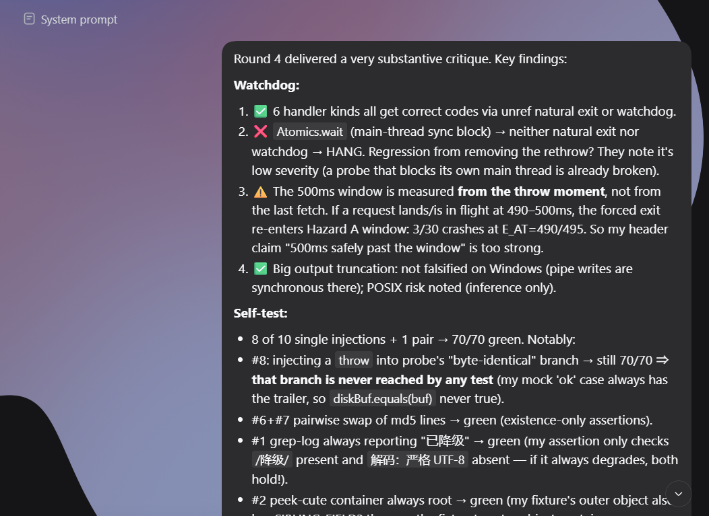

# dsh-cute-user-fold

折叠 DSH 会话里**过长的用户消息** —— 超过 8 行的收起来，只留 8 行 + 一个「展开」按钮。

Collapses **over-long user messages** in a DSH conversation: anything past 8 lines is folded
with a bottom fade, plus a button to expand.

<p align="center">
  <b>折叠态（默认）</b> —— 超过 8 行收起、底部渐隐、下方出现「展开」按钮<br>
  
</p>

<p align="center">
  <b>展开态（点击后）</b> —— 完整显示，按钮变为「收起」<br>
  
</p>

---

## 为什么需要它 / Why

DSH 默认把用户请求**完整铺开** —— 气泡是 `white-space: pre-wrap`，粘一段长文本就能撑出
几十行，长会话因此变得臃肿。同类工具有把长输入收起的做法，而 DSH 本体没有：官方对
消息气泡**没有任何高度限制**，官方那套 `data-turn-process-*` 折叠的是 **assistant 侧的
回合过程**，并不覆盖用户消息（2026-09-25 实测，见下）。

DSH renders user requests in full: the bubble uses `white-space: pre-wrap`, so pasting a long
block expands to dozens of lines and makes long sessions unwieldy. Other tools fold long inputs;
DSH itself does not — the official bubble has **no height limit**, and the official
`data-turn-process-*` machinery folds the **assistant-side turn process**, not user messages
(measured 2026-09-25, see below).

<details>
<summary>如何确认官方没做 / How this was verified</summary>

| 检查 | 结果 |
|---|---|
| 官方 `.bubble` 的 CSS | 只有 background / 字号 / 行高 / 圆角 / padding，**无任何高度限制** |
| 官方 CSS 里的 `line-clamp` | 仅用于**回合预览气泡**（悬停预览卡），不是消息本体 |
| `data-turn-process-*` 属性 | 属 `turn-process` 机制，折叠 **assistant 侧过程**；`user` 节点只被当作判定输入 |
| 官方 200+ 包全量扫描 | 关于「折叠用户消息」的实现 **0 命中** |
| 官方「折叠/收起/展开」文案（28 条） | 全是工具输出 / diff / 边栏 / trajectory / 问题卡片，**无一条指向用户消息** |

</details>

## 行为 / Behaviour

| 情况 | 表现 |
|---|---|
| 消息 ≤ 8 行 | **完全不动** —— 不加属性、不插节点、不影响任何样式 |
| 消息 > 8 行 | 收起为 8 行，底部渐隐，下方出现「展开」按钮 |
| 点击「展开」 | 完整显示，按钮变「收起」 |
| 点击「收起」 | 回到 8 行 |
| 流式新增的消息 | 由观察器自动处理，无需刷新 |
| 助手侧的消息 | **不受影响**（作用域限定在 `data-chat-flow-kind="user"`） |

Messages of 8 lines or fewer are **completely untouched** — no attributes, no injected nodes, no
styles. Anything longer folds to 8 lines with a bottom fade and an expand button. Streaming
messages are picked up by an observer; assistant-side content is out of scope.

用户中途改字号时，折叠高度会自动跟随行高，无需重启。

Fold height follows the user's font size automatically (no restart needed).

---

## Install

```bash
dsh plugin --profile web add <path-to-this-package>
```

Takes effect after that profile is **restarted** (the profile config is read at startup).

Uninstall:

```bash
dsh plugin --profile web remove dsh-cute-user-fold
```

## How it works

Folding needs two things plain CSS cannot do: **measuring** the rendered height (to decide
whether a message is "too long"), and **handling a click** (to expand). So this plugin is
**JS marks elements, CSS renders**:

```
JS  : inside [data-chat-flow-kind="user"], find the bubble, measure it;
      if too long, mark it with data-cuf-* and inject a button
CSS : keys off this plugin's own data-cuf-* attributes only
```

The one place the JS touches a build-hashed class is a single match of the `_bubble` **semantic
suffix**, always **scoped inside** `[data-chat-flow-kind="user"]` — an attribute DSH's own
stylesheet already uses, so it is treated as a public contract. The element is then re-marked
with this plugin's own attribute, and the stylesheet never sees a hashed name.

Fold height is `max-height: calc(8lh)` so it tracks the element's own line-height, with a
JS-computed pixel value as a fallback for browsers that do not support the `lh` unit.

Anchor forensics — what was measured, on which package, and which alternatives were rejected —
are in [docs/DOM-FORENSICS.md](docs/DOM-FORENSICS.md).

## Self-check

```bash
npm install          # dev dependency: playwright-core (test-only, pinned exactly)
npm test             # = lint + verify
```

- **`lint.mjs` (13 checks)** — static constraints: the two CSS copies agree, the bundle
  registration key equals the package name, no build-hashed class names, no literal colors, no
  overridden official geometry.
- **`verify.mjs` (51 assertions)** — a real headless Chromium renders a replica of the DOM and
  **actually executes** `lib/client.js`, asserting fold/expand, non-interference with
  assistant-side content, idempotence, and font-size following.

> `verify.mjs` caught a defect that reading the code could not: `max-height` applies to the
> **content box** only, so padding adds on top — the first version folded every message 20px too
> tall. An earlier revision of its harness also **covered for a real bug** by inventing a
> CommonJS shim the runtime does not actually provide.

## Known limitations

- **Depends on one semantic suffix** (`[class*="_bubble"]`). If DSH renames that CSS Module, the
  plugin stops working **silently** (no error, no folding). Scoping the match inside
  `[data-chat-flow-kind="user"]` keeps the blast radius minimal; the hardening path is for DSH to
  give the bubble an unconditional semantic attribute.
- **User messages only.** Folding turns / tool calls / thinking blocks is out of scope.
- **Fold state is not persisted** across reloads — messages start folded again.

## License

MIT
